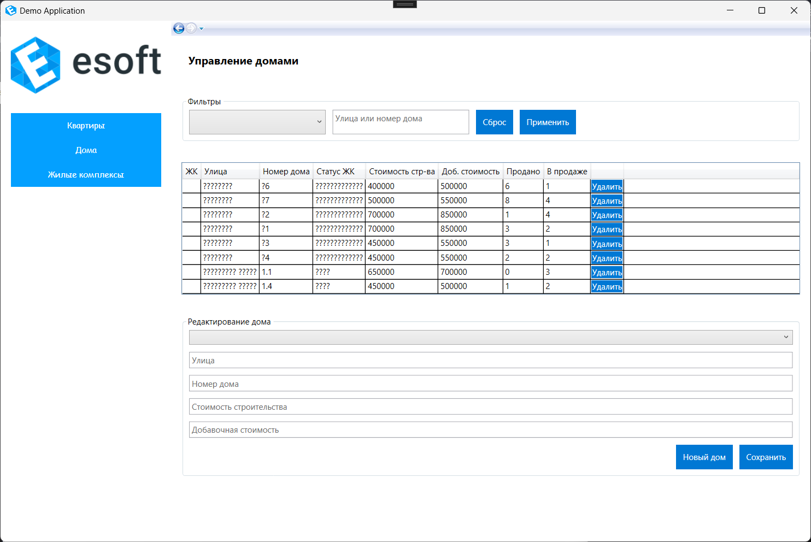
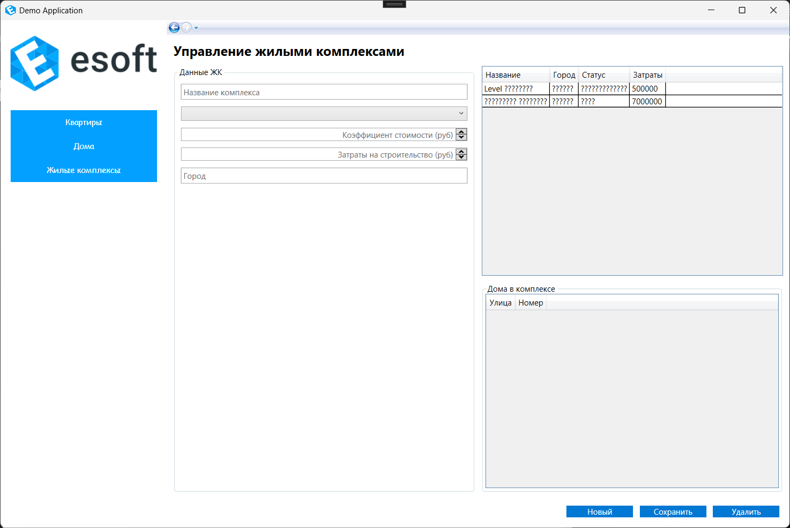

# Жилищный комплекс: Система управления для компании-застройщика

## 📝 Описание проекта
Программное решение для автоматизации работы строительной компании. Позволяет:  
- Управлять жилыми комплексами, домами и квартирами.  
- Рассчитывать себестоимость, наценку и итоговую цену. `(Ещё в разработке) ` 
- Отслеживать статусы объектов ("Продано", "В продаже").  

**Цель**: Упростить планирование и учет для сотрудников компании-застройщика.

---

## 🛠 Технологии
- **Платформа**: WPF (C#)  
- **База данных**: `Demo.bacpac` (импортируется через SQL Server Management Studio)  

---

## 🖥 Скриншоты интерфейса

### 1. Управление домами
  

### 2. Редактор жилых комплексов
   

### 3. Список объектов
  

---

## 🚀 Установка
1. **Установите приложение**:  
   Скачайте `Setup.msi` из [раздела релизов](https://github.com/TwoRulonOboev/DemoTest/releases/tag/First_Setup.msi) и запустите.  
2. **Настройте базу данных**:  
   - Импортируйте файл `Demo.bacpac` через **SQL Server Management Studio**.  
   - На сервер `(localDB)\MSSQLLocalDB`.  

---

## 📄 Контакты
Для вопросов и поддержки:  
📧 **Email**: kokoriri2112@gmail.com 

---

**Разработано при поддержке CanOfBeer>**  
_IT-решения для вашего бизнеса._

# **Руководство оператора для системы управления жилищными комплексами**  

---

### 1. Восстановление базы данных  
1. **Подготовка среды**  
   - Убедитесь, что установлена **Microsoft SQL Server** и SQL Server Management Studio (SSMS).  
   - База данных хранится в репозитории по пути `Database\Demo.bacpac`.  
2. **Восстановление БД**  
   1. Запустите SSMS и подключитесь к серверу.  
   2. Используйте инструмент **Import Data-tier Application** для импорта `Demo.bacpac`.  
   3. Проверьте созданные таблицы: `ЖилищныеКомплексы`, `Дома`, `Квартиры` и т.д.  

---

### 2. Список жилищных комплексов (ЖК)  
1. **Отображение списка ЖК**  
   - Поля:  
     - Название ЖК  
     - Статус (план/строительство/реализация)  
     - Количество домов  
     - Город  
   - **Сортировка**: Сначала по городам (А-Я), затем по статусу (план → строительство → реализация).  
2. **Фильтрация**  
   - **По статусу**:  
     - Выберите статус из выпадающего списка (все/план/строительство/реализация).  
   - **По городу**:  
     - В списке городов отображаются только те, где есть неудаленные ЖК.  
3. **Действия с ЖК**  
   - **Создание нового ЖК**:  
     - Укажите название, коэффициент добавочной стоимости (неотрицат.), статус, затраты, город.  
   - **Редактирование ЖК**:  
     - Запрещено изменить статус на "план", если в ЖК есть квартиры со статусом "продана".  
   - **Удаление ЖК**:  
     - ЖК нельзя удалить, если у него есть дома или связанные квартиры.  

---

### 3. Интерфейс ЖК  
1. **Редактирование/создание ЖК**  
   - Обязательные поля: название, коэффициент стоимости, статус, затраты, город.  
   - Коэффициент и затраты — неотрицательные числа.  
2. **Список домов в ЖК**  
   - Отображение:  
     - Улица  
     - Номер дома (включая строковые значения, например, ГП-1)  
     - Статус дома (наследуется из ЖК)  

---

### 4. Список домов  
1. **Отображение списка домов**  
   - Поля:  
     - ЖК  
     - Улица  
     - Номер дома  
     - Статус строительства (из ЖК)  
     - Количество проданных квартир  
     - Количество продающихся квартир  
2. **Фильтрация**  
   - По ЖК: выберите ЖК из списка.  
   - По адресу: введите улицу и/или номер дома.  
3. **Действия с домами**  
   - **Создание дома**:  
     - Укажите улицу, номер дома, ЖК (из списка неудаленных), коэффициент ℎ, затраты.  
   - **Редактирование дома**:  
     - Номер дома может быть строковым (например, ГП-1).  
   - **Удаление дома**:  
     - Дом нельзя удалить, если у него есть связанные квартиры.  

---

### 5. Технические ограничения  
1. **Ограничения на удаление**  
   - ЖК/дом нельзя удалить, если они связаны с квартирами.  
2. **Коэффициенты стоимости**  
   - Коэффициенты ℎ и добавочной стоимости ЖК должны быть ≥ 0.  
3. **Статус ЖК**  
   - Статус ЖК нельзя изменить на "план", если в ЖК есть проданные квартиры.  

---

### 6. Рекомендации  
- Регулярно создавайте резервные копии БД.  
- Проверяйте корректность данных перед сохранением.  
- Используйте фильтрацию и поиск для работы с большими списками.  

# **Техническое задание на разработку системы управления жилищными комплексами**  

---

### **1. Введение**  
**1.1 Наименование программы**  
Наименование системы — **«ЖК Менеджер»**.  

**1.2 Краткая характеристика области применения**  
Система предназначена для управления жилищными комплексами (ЖК), домами, квартирами, а также для отслеживания статусов строительства и продаж. Администраторы могут добавлять/редактировать ЖК и дома, управлять списками, фильтровать данные по городам и статусам, а также анализировать продажи квартир.  

---

### **2. Основания для разработки**  
Основанием для разработки является **Договор №45** от 15.03.2023, утвержденный Директором ООО «Строительные решения» Сидоровым Иваном Петровичем (Заказчик) и Разработчиком Кузнецовым Петр Степановичем (Исполнитель).  
Сроки:  
- Сдача системы — **30.09.2023**.  
- Поставка документации — **15.10.2023**.  

---

### **3. Назначение разработки**  
**3.1 Функциональное назначение**  
- Управление ЖК: добавление, редактирование, удаление.  
- Управление домами: добавление, редактирование, удаление.  
- Отслеживание статусов строительства (план/строительство/реализация).  
- Фильтрация и поиск ЖК по городу, статусу, названию.  
- Анализ продаж квартир.  

**3.2 Эксплуатационное назначение**  
Система работает на ПК администраторов. Запуск автоматизирован после входа в ОС.  

---

### **4. Требования к программе**  
**4.1 Функциональные требования**  
**4.1.1 Основные функции**  
- **Список ЖК**:  
  - Отображение в виде таблицы с полями: название, статус, количество домов, город.  
  - Фильтрация по статусу (все/план/строительство/реализация).  
  - Сортировка по городу и статусу.  
  - Удаление ЖК с проверкой на наличие связанных домов/квартиры.  
- **Создание/редактирование ЖК**:  
  - Поля: название, коэффициент добавочной стоимости, статус, затраты, город.  
  - Запрет изменения статуса на "план", если в ЖК есть проданные квартиры.  
- **Список домов**:  
  - Отображение: ЖК, улица, номер дома, статус, количество проданных/продаваемых квартир.  
  - Фильтрация по ЖК и адресу.  
- **История продаж квартир**:  
  - Сортировка по дате продажи.  

**4.1.2 Требования к данным**  
- База данных хранится в MS SQL Server (структура: таблицы `ЖилищныеКомплексы`, `Дома`, `Квартиры`).  
- Данные импортируются из файлов (CSV/Excel) через встроенный инструмент.  

**4.2 Требования к надежности**  
- Вероятность безаварийной работы: **99.9%**.  
- Время восстановления после сбоя: **5 минут**.  

**4.3 Технические требования**  
- **Клиентская часть**:  
  - Операционная система: Windows 10/11.  
  - RAM: 4 ГБ.  
- **Серверная часть**:  
  - MS SQL Server 2019.  
  - RAM: 8 ГБ.  

---

### **5. Требования к безопасности**  
- Ролевая модель доступа: администраторы, гости.  
- Шифрование данных в базе (AES-256).  

---

### **6. Стадии разработки**  
1. **Анализ требований** — 1 месяц.  
2. **Разработка прототипа** — 2 недели.  
3. **Реализация функционала** — 3 месяца.  
4. **Тестирование** — 1 месяц.  
5. **Внедрение** — 2 недели.  

---

### **7. Требования к документации**  
- Руководство пользователя.  
- Руководство администратора.  
- Техническая документация по БД.  

---

### **8. Приложения**  
- Скрипты БД: `ms.sql` для MS SQL Server.  
- Примеры данных для импорта: `import\ЖК.csv`, `import\Дома.csv`.  

